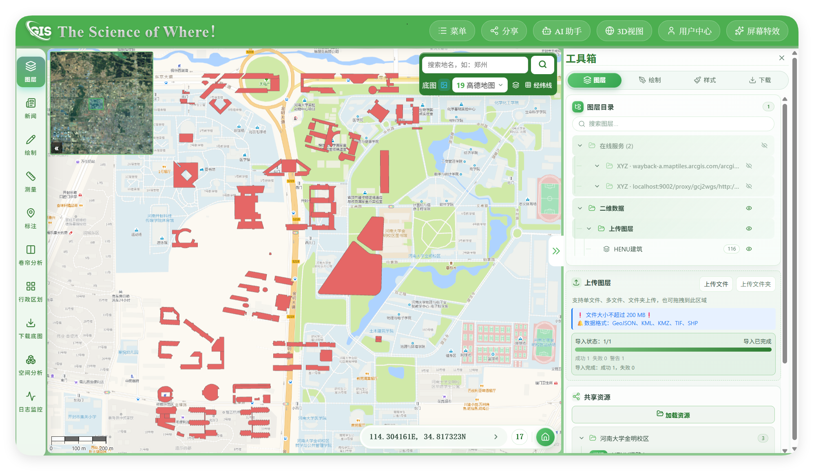
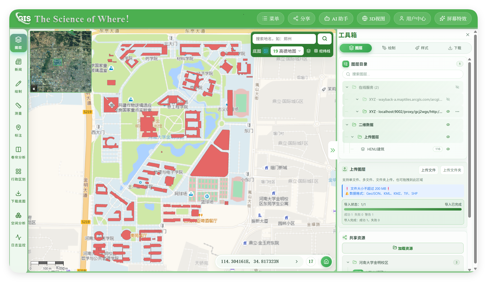

# tile-proxy

**地图瓦片直通代理 + GCJ-02 / BD-09 → WGS84 纠偏**（FastAPI，可独立运行）。

把国内加偏瓦片（高德/腾讯/天地图/百度）逐瓦片重采样成 **WGS84 标准 XYZ**；也可让境外服务器代拉 Google/Carto 等瓦片并解决 CORS。

依赖仅 `fastapi` · `uvicorn` · `httpx` · `pillow`，适合 1GB 级 VPS，也适合本机一条命令跑通。

## 效果展示（河南大学 · 高德电子图）

同一组 **GCJ-02 XYZ** 源瓦片：左为纠偏前按标准 XYZ 直接贴（相对 WGS 数据偏移）；右为经 `/proxy/gcj2wgs/` 输出的 **WGS84 对齐** 瓦片。

| 纠偏前（GCJ 瓦片直贴） | 纠偏后（WGS84 对齐） |
|:---:|:---:|
|  |  |

上游模板（与图中一致）：

```text
http://webrd01.is.autonavi.com/appmaptile?lang=zh_cn&size=1&scale=1&style=8&x={x}&y={y}&z={z}
```

纠偏后仅在前面加前缀：

```text
https://你的域名/proxy/gcj2wgs/http://webrd01.is.autonavi.com/appmaptile?lang=zh_cn&size=1&scale=1&style=8&x={x}&y={y}&z={z}
```

---

## 两类用户，两条路径

### 路径 1 — 部署到线上（团队/站点长期使用）

你要：自己的域名或内网入口，浏览器/APP 统一打你的服务。

| 方式 | 做法 |
|---|---|
| **代码 + systemd + nginx** | 见 [`docs/deployment.md`](docs/deployment.md) §B |
| **Docker / compose** | 见 [`docs/deployment.md`](docs/deployment.md) §C |

```bash
# 最小生产形态（VPS）
git clone <repo> /opt/tile-proxy && cd /opt/tile-proxy
python3 -m venv .venv && .venv/bin/pip install -r requirements.txt
.venv/bin/uvicorn app:app --host 127.0.0.1 --port 9002 --workers 1
# 前面挂 nginx：location /proxy/ → 127.0.0.1:9002
```

或：

```bash
docker compose up -d   # 默认只绑 127.0.0.1:9002
```

前端把底图 URL 改成：

```text
https://你的域名/proxy/gcj2wgs/https://webrd02.is.autonavi.com/appmaptile?...&x={x}&y={y}&z={z}
```

生产必改：单 worker、`PROXY_TILE_CACHE_MAX_SIZE=3000`、`PROXY_RATE_LIMIT>0`、`PROXY_ALLOW_PRIVATE_HOSTS=false`。详见 [配置](docs/configuration.md)。

---

### 路径 2 — 个人本机（clone 即用，只做纠偏/试代理）

你要：本机起一个服务，OL/Leaflet/Cesium 连 `127.0.0.1:9002`，马上看到纠偏后的 WGS 底图。

**Python：**

```bash
git clone <repo> tile-proxy
cd tile-proxy
python3 -m venv .venv
. .venv/bin/activate          # Windows: .venv\Scripts\activate
pip install -r requirements.txt
uvicorn app:app --host 127.0.0.1 --port 9002
```

**Docker：**

```bash
docker compose up -d
# 或
docker build -t tile-proxy . && docker run --rm -p 127.0.0.1:9002:9002 tile-proxy
```

浏览器打开 [`examples/openlayers-demo.html`](examples/openlayers-demo.html)，基址填 `http://127.0.0.1:9002`，点「高德 gcj2wgs」即可对比纠偏效果。

本地验证：

```bash
curl -o g.png "http://127.0.0.1:9002/proxy/gcj2wgs/https://webrd02.is.autonavi.com/appmaptile?lang=zh_cn&size=1&scale=1&style=8&x=6920&y=3077&z=13"
```

个人场景默认不必改配置；磁盘缓存在 `./data/gcj_rectify_cache`。

---

## 它解决什么

| 需求 | 端点 |
|---|---|
| 浏览器拉不动境外瓦片 / 无 CORS | `GET /proxy/{host+path}` 直通 |
| 高德等 GCJ 瓦片要和 GPS/OSM 对齐 | `GET /proxy/gcj2wgs/{上游URL}` |
| 百度 BD-09 瓦片要和 WGS84 对齐 | `GET /proxy/bd2wgs/{上游URL}`（标准 XYZ 索引） |
| 反向：WGS 源贴到 GCJ/百度网格 | `wgs2gcj` / `wgs2bd` |

`{x}{y}{z}` 语义、前端接入（OL / Leaflet / MapLibre / Cesium）见 [`docs/usage.md`](docs/usage.md)。

---

## 典型案例：高德电子图纠偏后叠 WGS84 数据

高德电子/影像瓦片是 **GCJ-02**。若地图引擎按 **WGS84 标准 XYZ** 索引直接加载，路网会相对 GPS 轨迹、OSM、Esri 等 WGS 图层**整城偏移**（城区可达数百米）。

**做法**：把上游模板放进 `/proxy/gcj2wgs/`，引擎仍用标准 `{x}{y}{z}`，返回的 PNG 已按 WGS 网格重采样，可直接叠 WGS 数据。

线上示例（可作生产模板，把域名换成你自己的）：

```text
https://vpn.negiao.cn/proxy/gcj2wgs/http://webrd01.is.autonavi.com/appmaptile?lang=zh_cn&size=1&scale=1&style=8&x={x}&y={y}&z={z}
```

本机等价：

```text
http://127.0.0.1:9002/proxy/gcj2wgs/http://webrd01.is.autonavi.com/appmaptile?lang=zh_cn&size=1&scale=1&style=8&x={x}&y={y}&z={z}
```

OpenLayers：

```js
new ol.layer.Tile({
  source: new ol.source.XYZ({
    url:
      "https://vpn.negiao.cn/proxy/gcj2wgs/" +
      "http://webrd01.is.autonavi.com/appmaptile?lang=zh_cn&size=1&scale=1&style=8&x={x}&y={y}&z={z}",
  }),
});
// 之后 GPS / GeoJSON / OSM 叠加层坐标不用改
```

`style=8` 为高德电子图；影像等其它 style 同理套同一前缀。更多场景见 [`docs/usage.md`](docs/usage.md)。

---

## 路由速查

| 路由 | 说明 |
|---|---|
| `/proxy/{host+path}` | 通用直通 + 浏览器头 |
| `/proxy/gcj2wgs/{url}` | GCJ → WGS84 对齐 |
| `/proxy/wgs2gcj/{url}` | WGS84 → GCJ 对齐 |
| `/proxy/bd2wgs/{url}` | BD-09 → WGS84（跨网格） |
| `/proxy/wgs2bd/{url}` | WGS84 源 → 百度网格 |
| `/health` | 探活 |

CORS 默认 `*`。

---

## 文档

| 文档 | 给谁看 |
|---|---|
| [docs/deployment.md](docs/deployment.md) | **路径 1** 线上：nginx / systemd / Docker |
| [docs/usage.md](docs/usage.md) | **路径 1+2** 契约、索引语义、前端案例 |
| [docs/configuration.md](docs/configuration.md) | 生产护栏与全部 env |
| [docs/architecture.md](docs/architecture.md) | 纠偏原理、GCJ/BD 网格、模块结构 |

**原理延伸阅读（站外笔记）：**

- [非标准 XYZ 与 GCJ-02 瓦片](https://www.negiao.cn/Pages/Note/note-viewer/note-viewer.html?note=non-standard-xyz-and-gcj02) —— 为何国内图源不能当标准网格贴
- [瓦片纠偏接缝与 QUAD 重采样](https://www.negiao.cn/Pages/Note/note-viewer/note-viewer.html?note=tile-rectify-seam-quad-resampling) —— 四角逐点几何无缝的做法

---

## 结构

```
app.py / config.py          入口与配置
domains/tiles/              纠偏库 + 代理路由 + SSRF/缓存清理
deploy/                     systemd、nginx、install.sh
Dockerfile · docker-compose.yml
examples/openlayers-demo.html
docs/
```

---

## 合规

- 仅代理你有权访问的公开资源；勿做开放代理。
- 默认禁止代访内网；公网请开限流。
- GCJ 算法源自 QGIS OffsetWGS84Core（**GPLv2+**），见 `transform.py` 与 [LICENSE](LICENSE)。
- **不要**把本服务部署在禁止第三方内容中转的托管平台（如 HF Spaces）；请用自己的 VPS/服务器。

---

## License

GPL-2.0-or-later（见 [LICENSE](LICENSE)）。
