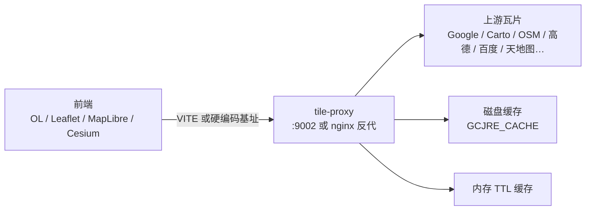
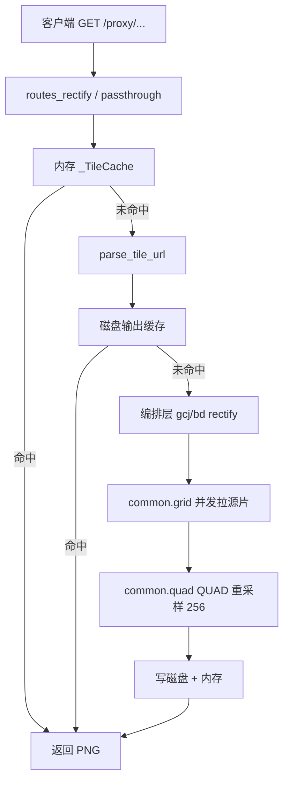

# 架构说明

本文从 WebGIS 项目的纠偏体系文档迁入并改写，描述 **tile-proxy 独立服务** 的原理与模块边界。

**延伸阅读：**

- [非标准 XYZ 与 GCJ-02](https://www.negiao.cn/Pages/Note/note-viewer/note-viewer.html?note=non-standard-xyz-and-gcj02)
- [纠偏接缝与 QUAD 重采样](https://www.negiao.cn/Pages/Note/note-viewer/note-viewer.html?note=tile-rectify-seam-quad-resampling)

## 1. 定位

服务做两件事：

1. **直通代理**：代浏览器取第三方瓦片/文档，补 UA/Referer，回 CORS。
2. **纠偏代理**：按请求网格重采样，输出与标准 XYZ（或百度网格）对齐的 PNG。

## 2. 为什么必须纠偏

| 坐标系 | 谁在用 | 与 WGS84 |
|---|---|---|
| WGS84 | GPS、OSM、Esri、多数 Web 地图工作空间 | 基准 |
| GCJ-02 | 高德、腾讯、谷歌中国、天地图 | 非线性偏移，城区可达数百米 |
| BD-09 | 百度 | GCJ 之上再加偏 |
| BD09MC | 百度瓦片网格 | **独立投影 + 独立网格**（不只是坐标值偏） |

把 GCJ 瓦片当标准 XYZ 贴到 WGS84 画布 → **整城错位**。

### GCJ vs BD 的本质差别

| | GCJ-02 ↔ WGS84 | BD-09 ↔ WGS84 |
|---|---|---|
| 网格 | **同**标准 Web 墨卡托，仅坐标值偏 | **跨网格**（BD09MC 原点居中、Y 向上） |
| 分辨率 | 同 z 1:1 | 约 `z_bd ≈ z±1` 对齐 |
| 做法 | 同索引换 bbox → QUAD | 拉覆盖网格 → Y 翻转 → QUAD |
| 重采样 | BILINEAR | BICUBIC（约 306→256） |
| z≤9 | 直通源片（偏差亚像素） | 同左 |

**百度墨卡托不是球面墨卡托**，而是 JS API 的分段六阶多项式。用球面公式近似在北京会偏约 15–23 km——实现见 `domains/tiles/rectify/bd/mercator.py`。

网格定义与「不能当标准 XYZ」的展开说明：[非标准 XYZ 与 GCJ-02](https://www.negiao.cn/Pages/Note/note-viewer/note-viewer.html?note=non-standard-xyz-and-gcj02)。

## 3. 请求链路

依赖铁律：`bd → common ← gcj`；`common` 不 import 兄弟包。

## 4. 模块职责

| 路径 | 职责 |
|---|---|
| `app.py` | FastAPI、CORS `*`、挂载 `tiles_router`、启停磁盘清理 |
| `config.py` | 仅 env 的 get_str/int/bool |
| `domains/tiles/_router.py` | **先**纠偏路由，**后**通配直通（顺序=正确性） |
| `routes_rectify.py` | 4 条纠偏端点 + 错误码 400/504/502 |
| `routes_passthrough.py` | `/proxy/{url}` 流式 + 可选 ships66 |
| `proxy_shared.py` | 内存缓存、限流、SSRF、出站 httpx |
| `cache_cleanup.py` | 按龄 + 按容量清磁盘缓存 |
| `infra/net_guard.py` | 私网/DNS 复判/白名单 |
| `infra/http_headers.py` | 浏览器 UA、sec-ch-ua、Referer 白名单 |
| `rectify/common/transform.py` | WGS/GCJ/BD 点坐标互转（含牛顿迭代逆解） |
| `rectify/common/grid.py` | 信号量并发、字节/像素/网格数护栏、文件缓存、拼接 |
| `rectify/common/quad.py` | 四角 QUAD 透视（几何无缝原语；见[接缝与 QUAD 笔记](https://www.negiao.cn/Pages/Note/note-viewer/note-viewer.html?note=tile-rectify-seam-quad-resampling)） |
| `rectify/gcj/rectify.py` | GCJ 编排 |
| `rectify/bd/*` | BD09MC 投影 + 跨网格编排 |

## 5. URL 模板

客户端传入的是**带真实坐标的完整上游 URL**。解析三档：

1. **format**：正则找 `x=` / `tilecol=` 等，替换为 `{x}{y}{z}`
2. **query**：`parse_qsl` 只换三键
3. **path**：路径数字 token 全枚举，专治 Google `maps/vt pb=!1m4!...`

模板指纹 `sha1(template)[:16]` 作磁盘缓存顶层目录，不同样式天然隔离。

## 6. 护栏

| 项 | 默认 | 作用 |
|---|---|---|
| `GCJRE_TILE_MAX_MB` | 8 | 单源片字节上限 |
| `GCJRE_MAX_IMAGE_PIXELS` | 16M | 解压炸弹 |
| `GCJRE_MAX_TILES_PER_REQUEST` | 64 | 单请求网格片数 |
| `GCJRE_MAX_CONCURRENCY` | 16 | 源片并发（VPS 建议 4） |
| `PROXY_RATE_LIMIT` | 0 | 每 IP 限流（公网必开） |
| `PROXY_ALLOW_PRIVATE_HOSTS` | false | SSRF |

单片失败补透明空白，不断整流。

## 7. 已知约束

1. z≤9 GCJ 直通是近似（&lt;1px）。
2. 百度街道底图验证到 z18，更高层先实测。
3. `wgs2bd` 的输入索引是**百度网格**；`bd2wgs` 是**标准 XYZ**——传错会静默错位。
4. 境外 `out_of_china` 直通，是 feature。
5. 磁盘清理与写缓存为 best-effort，无文件锁。

## 8. 历史来源

实现自 WebGIS-Dev `backend/domains/tiles/` 抽出（2026-09），使托管平台上的业务后端不再承担第三方内容中转。
